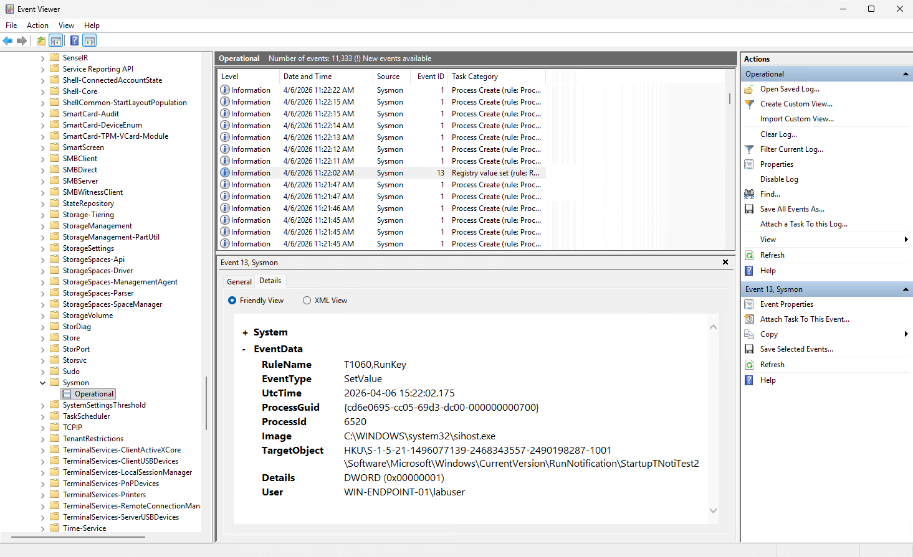
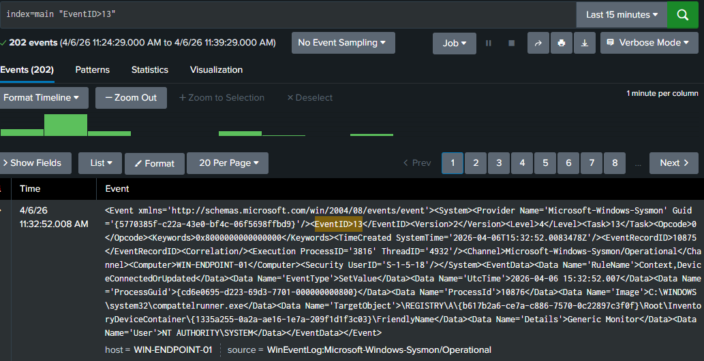
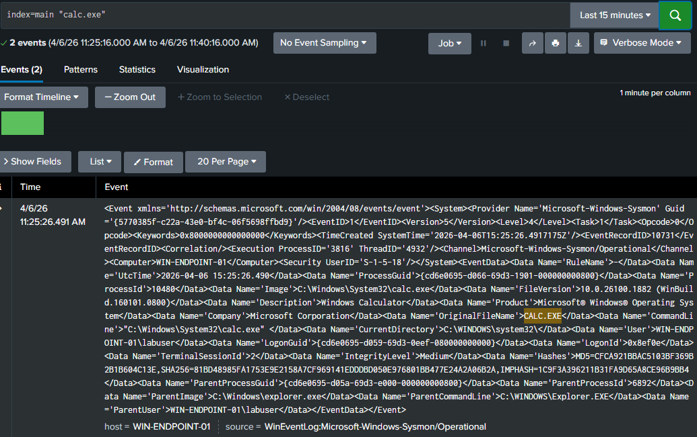
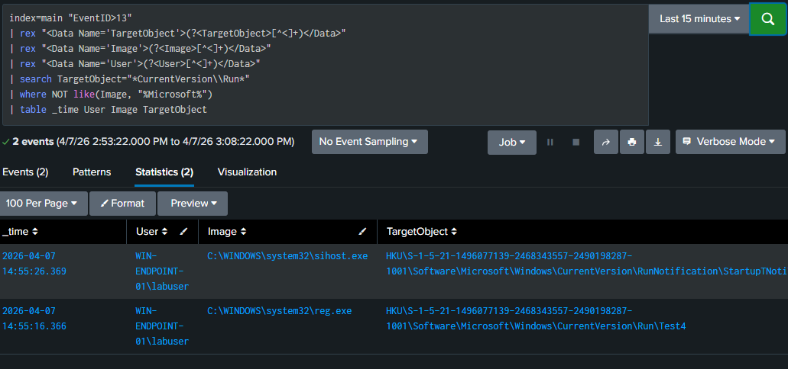
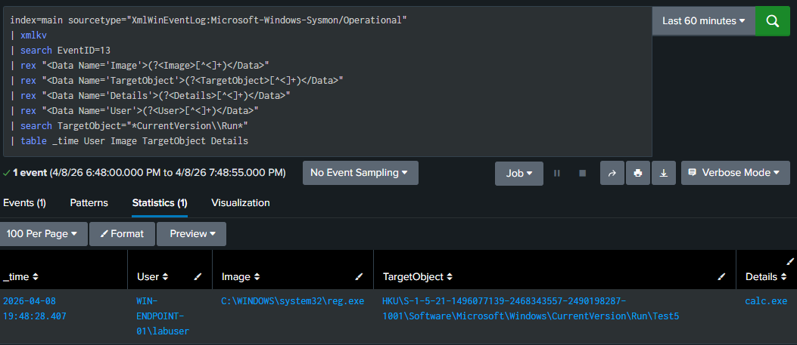

# Lab 2 - Detecting Registry Run Key Persistence with Sysmon and Splunk

## Overview

This lab demonstrates how to detect Windows registry-based persistence using Sysmon and Splunk. The objective was to simulate persistence through the Run key, verify telemetry generation on the endpoint, confirm ingestion into Splunk, troubleshoot parsing issues, and refine the detection from simple payload-based searches to a behavior-based query with context.

## Lab Environment

* Host Hypervisor: Hyper-V
* SIEM: Splunk Enterprise on Ubuntu
* Endpoint: Windows 11 VM
* Telemetry Source: Sysmon
* Log Forwarding: Splunk Universal Forwarder

## Goal

Detect registry persistence created through:

HKCU\Software\Microsoft\Windows\CurrentVersion\Run

and capture:

* the user responsible
* the process that made the change
* the registry path modified
* the payload written to the Run key

## Attack Simulation

### Command Used

```
reg add HKCU\Software\Microsoft\Windows\CurrentVersion\Run /v Test5 /t REG_SZ /d "calc.exe"
```

### What It Does

This command creates a user-level Run key value that causes calc.exe to launch when the user logs in.

### MITRE ATT&CK

* T1547.001 - Registry Run Keys / Startup Folder

## Telemetry Validation

The simulated persistence generated:

* Sysmon Event ID 13 (Registry value set)

Validation steps:

1. Confirmed the event in Event Viewer on the Windows VM
2. Confirmed the event was ingested into Splunk
3. Confirmed the event could be detected with refined queries

---

## Detection Evolution

### 1. Raw Telemetry Check

Initial search:

```
index=main "EventID>13"
```

This worked because the data was ingested as raw XML rather than parsed fields.

---

### 2. Payload-Based Detection

Initial detection pivot:

```
index=main "calc.exe"
```

This confirmed that the payload executed, validating persistence, but lacked behavioral context.

---

### 3. Behavior-Based Detection with Context

Final detection query:

```
index=main sourcetype="XmlWinEventLog:Microsoft-Windows-Sysmon/Operational"
| xmlkv
| search EventID=13
| rex "<Data Name='Image'>(?<Image>[^<]+)</Data>"
| rex "<Data Name='TargetObject'>(?<TargetObject>[^<]+)</Data>"
| rex "<Data Name='Details'>(?<Details>[^<]+)</Data>"
| rex "<Data Name='User'>(?<User>[^<]+)</Data>"
| search TargetObject="*CurrentVersion\\Run*"
| table _time User Image TargetObject Details
```

### Why This Matters

This query detects persistence behavior rather than a specific payload and captures:

* user context
* process responsible (reg.exe)
* registry path modified
* payload written

---

## Key Findings

* Sysmon successfully captured registry persistence (Event ID 13)
* Splunk ingested logs as raw XML requiring manual extraction
* Field-based queries initially failed due to lack of parsing
* xmlkv + rex enabled structured detection
* Behavior-based detection is more reliable than payload-based detection
* Valid detections can return zero results if no recent telemetry exists

---

## Troubleshooting

### Issue 1

Problem: EventID=13 searches returned no results

Root Cause: Logs were ingested as raw XML without extracted fields

Fix:

* Used raw string search ("EventID>13")
* Applied xmlkv and rex for field extraction

Lesson Learned:

* Always validate parsing before relying on structured fields

---

### Issue 2

Problem: Final detection query returned zero results

Root Cause: No matching event existed in the selected time window

Fix:

* Re-ran the persistence command to generate fresh telemetry

Lesson Learned:

* Detection logic can be correct even when no results are returned

---

## Evidence Captured

### 1. Sysmon Event Viewer - Event ID 13



---

### 2. Splunk Raw XML Event (Event ID 13)



---

### 3. Payload-Based Detection (calc.exe)



---

### 4. Noise Reduction / Filtering



---

### 5. Final Behavior-Based Detection (Run Key Persistence)



---

## Skills Demonstrated

* Windows registry persistence analysis
* Sysmon telemetry validation
* Splunk log ingestion troubleshooting
* XML field extraction using xmlkv and rex
* Detection tuning and noise reduction
* Behavior-based detection engineering
* Incident-style documentation

---

## Conclusion

This lab demonstrates the progression from basic telemetry validation to a behavior-based detection capable of identifying registry persistence with full context. The key takeaway is that detection engineering depends heavily on understanding how data is ingested and parsed, and adapting detection logic accordingly.
